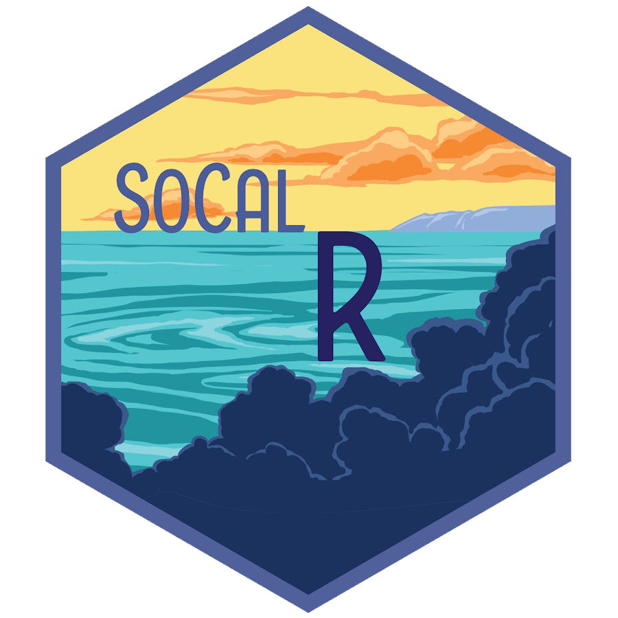

# Hackathon202204
  
**A Data Science Hackathon Event** hosted by [The Southern California R User Group (SoCal RUG)](https://www.meetup.com/SOCAL-RUG/?_cookie-check=zJt8rFuBCQGLY7eT)  
[SoCal RUG Github](https://github.com/socalrug/hackathon-2022-04)  
[Award Link](https://github.com/socalrug/hackathon-2022-04/blob/master/Awards.md)  
**Dates:** 4/2/2022 - 4/3/2022  

## Objective
Take a data set from its raw form and deliver a final product which can include data cleansing, analysis, predictions, modeling, insights, and visualizations.  
- Explore the Government Census data and choose any topic to construct a problem-solution format presentation.
## Awards Won
**Best Presentation** 

## DF_DataFriends Members:
1. Eric Lambert
2. Amit Moises Patel
3. Carlie Wade
4. Nguyen Huynh
5. Stephanie Wells